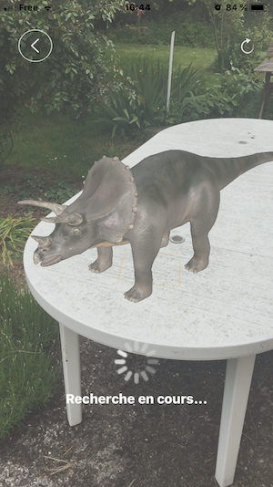

#  L’Application MengHuan
## Principe de MengHuan
MengHuan est une application en réalité augmentée, permettant aux enfants ou aux personnes curieuses de découvrir différents sujets par le biais de la réalité augmentée. L’application va permettre non seulement de visualiser et d’obtenir des informations sur les sujets observés mais aussi d’interagir directement avec eux. Qui n’a pas rêvé de voir de plus près le système solaire ou d’avoir un dinosaure dans son jardin ?

**L'application se compose dans sa première version de trois sujets :**
* Le Système Solaire
* Les dinosaures
* Les véhicules

Chaque sujet va permettre d’étudier et de manipuler des scènes permettant d’en apprendre un peu plus sur des espèces disparues, notre Système, ou de voir des véhicules du quotidien sous un autre angle.

**L'application se compose de plusieurs fonctionnalités principales :**
* La visualisation d’objet 3D dans un espace choisi
* La manipulation de ces objets en utilisant des « gestures » sur l’écran tactile
* La visualisation d’information provenant de Wikipédia
* L’accès à la page Wikipédia de l’élément observé

### Les sujets proposés

>> 1.  Le Système Solaire

Cette scène va nous permettre de visualiser le Système Solaire sous tous ses angles, d'apprendre son fonctionnement et d'étudier un peu plus précisément chaque étoile ou planète qui le compose.

>> 2. Les dinosaures

Cette scène va nous permettre de mettre en scène  plusieurs dinosaures et d'en découvrir un peu plus sur leurs vies et de les observer d'un peu plus près.

>> 3. Les véhicules

Cette scène sur le même modèle que pour les dinosaures va nous permettre de placer un véhicule sur un espace et de l'étudier, nous pourrons aussi intéragir avec lui.

### Les fonctionnalités

>> 1. La visualisation d’objet 3D dans un espace choisi

Dans MengHuan selon la scène choisie nous allons pouvoir visualiser un ou plusieurs objet 3D, c'est objets seront affichés en réalité augmentée, c'est à dire que vous allez pouvoir les visualiser chez vous dans une pièce ou pourquoi pas dans votre jardin et tourner autour afin de les étudier sous tous les angles.

>> 2. La manipulation de ces objets en utilisant des « gestures » sur l’écran tactile

Chaque élément est manipulable dans MengHuan, plusieurs "Gestures" on été prévu pour facilité l'intérraction avec ces objets.

**Voici ces différentes gestures :**

* La "TapGesture":
    * Elle va permettre si vous taper avec un doigt sur un élément d'obtenir des informations Wikipédia sur cette élément
    > Voici une animation présentant cette "gesture".
    
    

    * Elle va permettre d'ajouter un focus static pour déposer un objet soumis à la gravité.
    > Voici une image présentant le focus static.
    
    

    * Si vous tapez deux fois rapidement sur la scène du système solaire, cela va replacer l'élément là ou vous avez tapé.

* La "PinchGesture": Elle va permettre si vous posez deux doigts sur l'écran, en les rapprochant ou les éloignant de modifier la taille de l'élément observé.
> Voici une animation présentant la "gesture pinch et la "panGesture".

* La "PanGesture": Elle va permettre en posant deux doigts sur l'écran, de balayer à droite ou à gauche et ainsi faire tourner l'objet pour observer un autre angle.

* La "LongPressGesture": Elle va permettre en restant appuyé sur un élément avec le doigt soit:
    * De séléctionner un élément pour le système solaire

    * De faire disparaitre un élément pour le reposer avec une tap à un autre endroit.
    > Voici une animation présentant la "longPressGesture".
    
    

>> 3. La visualisation d’information provenant de Wikipédia

Dans MengHuan en tapant sur un élément, nous pouvons obtenir des informations Wikipédia par le biais d'un volet apparaissant en bas de l'écran.

    > D'abord un film apparait nous signifiant que la recherche Wikipédia est en cours.

    

    >  Ensuite les informations apparaîssent

    

>> 4. L’accès à la page Wikipédia de l’élément observé

Si le volet d'informations Wikipédia n'est pas suffisant, il suffit de poser le doigt dessus pour être dirigé directement sur la page Wikipédia concernée.

### Fonctionnement étape par étape

1. Le Système Solaire

Dès l'apparition de la scène, le système solaire est affiché, il n'y a pas d'action attendu pour l'afficher.

> Voici une animation présentant le démarrage de la scène.

Ensuite nous pouvons manipuler la scène présente avec la "PanGesture" ou la déplacer avec la "longpressgesture"
Il n'y a pas la possibilté d'utiliser la "pinchGesture" sur la scène principale pour éviter des déformations du système ce qui rendrait l'observation moins satisfaisante.

Si nous touchons une planète la recherche Wikipédia se lance comme nous l'avons vu précédement.
Nous pouvons arrêter la rotation des planètes à l'aide du bouton pause lecture présent en haut à droite.

Pour aller plus loin nous pouvons alors sélectionner une planète, soit en pressant plus longuement sur une planète, soit en la sélectionnant à l'aide du menu s'ouvrant lorsqu'on touche le bouton "système", le bouton prendra alors le nom de la planète selectionnée et seule celle-ci apparaitra.

> Voici une animation présentant cette fonctionnalité.

> Voici une image d'exemple.

Vous pouvez retourner retourner à l'écran d'accueil par le biais du bouton retour en haut à gauche.

2. Les scènes Dinosaures et Véhicules

Dans MengHuan les scène Dinosaures fonctionnent sur le mème principe.

Tout d'abord lorsque la scène se lance, un focus apparait qui se recadre en permanence sur le centre de la vue en suivant les surfaces planes.
lorsque ce focus est présent seul le bouton retour et accessible.
Ensuite lorsque une surface plane solide est détectée, un message signalant que la surface est détectée apparait en même temps que le bouton pour redémarrer la vue.

Si vous touchez alors l'écran un focus fixe apparait ainsi que le bouton de sélections d'objets.
Le menu qui apparait laissera apparaître uniquement les objets 3D correspondant à la scène choisie.

lorsque la sélection est faite seul l'élément sélectionné apparaitra sur la position du focus fixe.

> Voici une animation présentant cette fonctionnalité.

Ensuite libre à vous de manipuler l'élement pour l'observer apprendre des informations à son sujet.
Cette opération est la même quelque soit l'élément sélectionné dans les scènes dinosaures et vehicules

> pour exemple une autre animation avec un dinosaure.

Vous pouvez aussi déplacer l'élement comme nous l'avons vu précédement en pressant celui-ci puis en replaçant le focus à l'endroit désiré.

> Voici un exemple.

pour chaque élement vous pouvez obtenir des informations Wikipédia en touchant cet objet, pendant le temps de chargement une roue tourne pour indiquer la recherche en cours.

> Une recherche Wikipédia avec un avion.

